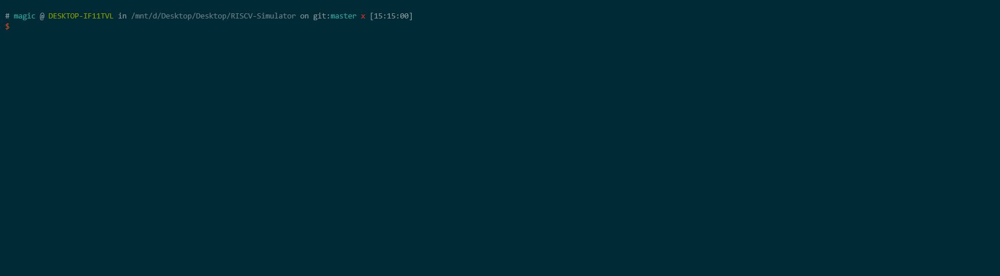

# RISCV-Simulator

A Simple RISC-V ISA Simulator that supports *RV64I* Base Instruction Set and *RV64M* Standard Extension, and can run in both <u>single-instruction mode</u> and <u>pipeline mode</u>. ✨

## Overview

This simulator functions in interactive mode like `gdb`. It provides following interactive operations that have functions similar with those in `gdb`. 

-  `c`: Continue running until the program comes to the end
-  `reg`: Display register information
-  `info`: Display the address of this symbol defined in ELF file
-  `si`: In single-instruction mode, the function of this operations is the same as that of `gdb`, namely running a single machine instruction. However, in pipeline mode, it means running a single pipeline stage.
-  ` x/<length><format> [address]`: Display the memory contents at a given address using the specified format.

- `status`(only in pipeline mode): Display the status of each pipeline register.

*<mark>Note</mark>: Operation `si` has different function in single-instruction mode and pipeline mode. We will explain why we have such design in the following section.*

## Dependencies

- If you would like to compile your customized C source codes into RISC-V executable file, you must have <u>RISC-V Compiler Toolchain</u> at first. You c to install them in your environment. You can built the toolchain on your environment by yourself, or download a RISC-V GCC toolchain prebuilt under compatible environment. [Here](https://www.sifive.com/boards) is a recommended prebuilt toolchain provided by `SiFive`.

  To further compile your customized C source codes, please refer to [this section](#how-to-compile-your-customized-c-source-codes-into-risc-v-executable-file) below.
  
- <u>[Go](https://golang.org/doc/install) with version 1.12 or later</u>: please refer to the official website to install Go in your environment. 

## How to compile your customized C source codes into RISC-V executable file?

First of all, ensure that you could find `riscv64-unknown-elf-gcc` and `riscv64-unknown-elf-objdump` in your `PATH` environment variable. Please refer to perspective online resources to learn how to add them into `$PATH` if you couldn’t find them.

```bash
$ riscv64-unknown-elf-gcc --version
riscv64-unknown-elf-gcc (SiFive GCC 8.3.0-2019.08.0) 8.3.0
Copyright (C) 2018 Free Software Foundation, Inc.
This is free software; see the source for copying conditions.  There is NO
warranty; not even for MERCHANTABILITY or FITNESS FOR A PARTICULAR PURPOSE.
$ riscv64-unknown-elf-objdump --version
GNU objdump (SiFive Binutils 2.32.0-2019.08.0) 2.32
Copyright (C) 2019 Free Software Foundation, Inc.
This program is free software; you may redistribute it under the terms of
the GNU General Public License version 3 or (at your option) any later version.
This program has absolutely no warranty.
```

A [makefile](./testcases/makefile) script has be provided under directory [testcases/](./testcases). Switch to this directory and type `make` , then any file with extension `*.c` under this directory will be compiled the RISC-V executable file as well as disassembled to corresponding assembly language file.

```bash
$ cd testcases
$ make
riscv64-unknown-elf-gcc -Wa,-march=rv64im -static -Wl,--no-relax -g -o hello.out hello.c
riscv64-unknown-elf-objdump -Sd hello.out > hello.asm
```

Note that several compiling flags are necessary

- ` -Wa,-march=rv64im`: compulsorily compile the source file into RV64I executable file
- `-static`: statically linking
- `-Wl,--no-relax`: To start running from `main`, we have to forbid the compiler to leverage the global pointer to optimize

*<mark>Note</mark>: This simulator currently only support 32-bit instruction. However, some linked library functions in prebuilt toolchain use 16-bit compressed Instructions, therefore this simulator currently starts running from `main` and does not support system calls.* 🤯🤯

See more info in [makefile](./testcases/makefile).

## Compilation

**Ubuntu18.04**
```bash
mkdir bin
export GOPATH=$(pwd)
go build -o bin/sim src/main.go
```

## How to configure my customized Instruction?

One sparkle point of this simulator is that it leverages <u>the design idea of data-driving</u>. In other words, by editing the table [src/action_table.csv](./src/action_table.csv) with portability, you could add, delete and modify the behavior or even the delay in each pipeline stage of any instruction, So you could design your customized instruction!😜

With little effort, the scope of supported instructions could be expanded with ease. To see how currently supported instructions function, please refer to [src/action_table.csv](./src/action_table.csv).

After you have configured your customized instruction, you have to generate code as following, and then recompile your code as illustrated in [this previous section](#compilation).

```bash
export GOPATH=$(pwd)
go run src/action_parser.go -f src/action_table.csv -t src/action.tmpl
go run src/microaction_parser.go -f src/action_table.csv -t src/microaction.tmpl
```

## Usage

This simulator support two modes: single-instruction mode and pipeline mode.

```bash
$ ./bin/sim --help
Usage of ./bin/sim:
  -f string
        Filepath of the ELF file
  -m string
        Simulation mode. Valid modes are: debug, pipeline (default "debug")
  -v    Display verbose info of ELF file. To disable displaying these info, type "-v=0" (de
fault true)
```

### Single-Instruction Mode

"Single-Instruction” means running only one single instruction each time you type `si`, the same as that in `gdb`. 

```bash
$ ./bin/sim -f testcases/add.out -m=debug -v=0
Start running...
PC(0x0000000000010188) -> 0x0000000000010188:           addi sp, sp, -32
(Debug) help
Usage:
   help                          : Display this message
   exit                          : Exit the debug prompt
   c                             : Continue running until the program comes to the end
   si                            : Run a single machine instruction
   reg                           : Display register information
   info [symbol name]            : Display the address of this symbol defined in ELF file. if "symbol name" is not specified, display all the symbols.
   x/<length><format> [address]  : Display the memory contents at a given address using the specified format. The address is PC by default
                                                                        Valid format specifiers are:
                                                                                        i - instruction
                                                                                        b - byte
                                                                                        h - half word(16-bit value)
                                                                                        w - word(32-bit value)
                                                                                        g - giant word (64-bit value)
```

Here is an example in single-instruction mode:


### Pipeline Mode

Suppose you have a primitive understanding of pipeline in the field of computer architecture. In pipeline mode, each time you type `si`, the simulator only run one pipeline step. Therefore, the modification on registers and memory could not make a in-time impact. 	When you type `status`, the simulator will display the status of the whole pipeline, which is convenient to understand what are happening when the pipeline functions! 🎃

```bash
$ ./bin/sim -f testcases/add.out -m=pipeline -v=0
Start running...
PC(0x0000000000010188) -> 0x0000000000010188:           addi sp, sp, -32
(PipeDebug) help
Usage:
   help                          : Display this message
   exit                          : Exit the debug prompt, and display the statistic
   c                             : Continue running until the program comes to the end
   si                            : Run a single pipeline stage
   reg                           : Display register information
   status                        : Display the status of each pipeline register
   info [symbol name]            : Display the address of this symbol defined in ELF file. if "symbol name" is not specified, display all the symbols.
   x/<length><format> [address]  : Display the memory contents at a given address using the specified format. The address is PC by default
                                                                        Valid format specifiers are:
                                                                                        i - instruction
                                                                                        b - byte
                                                                                        h - half word(16-bit value)
                                                                                        w - word(32-bit value)
                                                                                        g - giant word (64-bit value)
```

Here is an example in pipeline mode:



